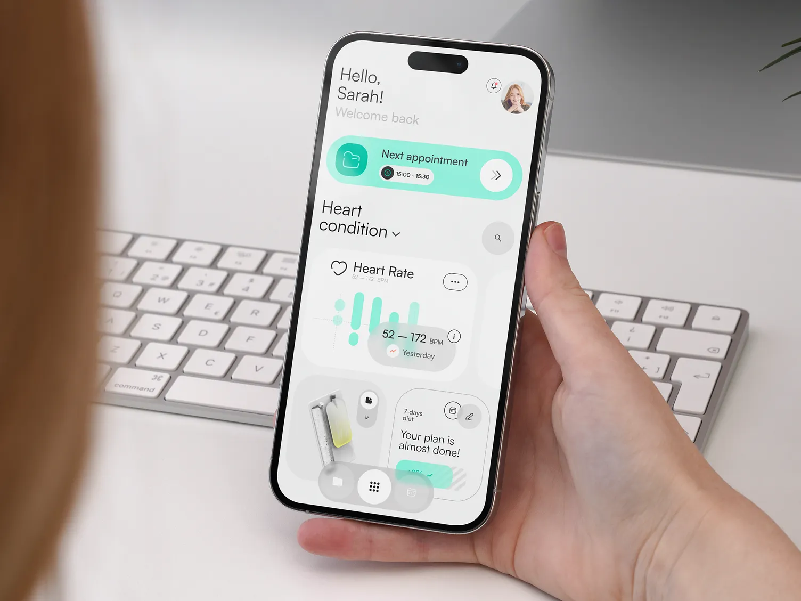

BROOOOOO. You're thinking correctly.

**Don't build another "AI-generated SaaS" looking thing.**

Those look awful.

Think:

* Blinkit
* Zomato
* Linear
* Stripe
* Notion
* Vercel
* Perplexity

Modern, minimal, smooth, premium.

---

# BIG IDEA 🔥

### Patient History by File Number

Receptionist enters:

```text
File Number: A-1024
```

Instantly:

### Timeline

```
2025 Jan 5
Prescription Image
Doctor Notes

2025 Feb 12
Blood Report

2025 Mar 2
Prescription Image

2025 Apr 9
Diabetes Follow-up
```

Beautiful card layout.

---

# Upload Prescription Photos

Supabase Storage.

Patient:

```text
file_no
name
phone
```

Files:

```text
id
patient_id
image_url
date
type

prescription
blood_report
xray
scan
```

---

# Search Patient

Receptionist types:

```text
A-1024
```

Immediately:

### Timeline

Like WhatsApp chat history.

---

# AI MAGIC 🔥

Upload image.

AI extracts:

```text
Medicine:
Metformin

Diagnosis:
Type 2 Diabetes

Doctor:
Dr Sharma

Date:
Jan 3
```

Store this.

Now future search becomes crazy powerful.

---

Search:

```text
Diabetes
```

or

```text
Metformin
```

Find all patients.

Doctors will love this.

---

# Even cooler

Patient comes after 2 years.

Doctor enters file number.

AI summarizes:

> Male, 56 years.
> Diabetes for 3 years.
> Previous 6 visits.
> Taking Metformin.
> Last consultation 4 months ago.

This saves huge time.

---

# UI STYLE

NOT:

❌ Bootstrap admin panel

❌ Typical AI dashboard

❌ Card overload

---

YES:

### Linear + Zomato + Blinkit

Think:

* Rounded corners
* Lots of whitespace
* Large typography
* Floating search
* Soft shadows
* Smooth animations

---

# Use these

### Tailwind

### shadcn/ui

### Motion

### MagicUI

### OriginUI

### Geist font

### Tanstack Table

---

# Colors

Primary:

```css
#2563EB
```

Background:

```css
#FAFAFA
```

Cards:

```css
white
```

Radius:

```css
24px
```

---

# Inspiration

### Mobbin ⭐⭐⭐⭐⭐

Search:

* Stripe
* Linear
* Notion

---

### Refero ⭐⭐⭐⭐⭐

[https://refero.design](https://refero.design)

Amazing SaaS references.

---

### Layers

[https://layers.to](https://layers.to)

---

### Design Aliens

[https://designaliens.com](https://designaliens.com)

---

### UI8

Premium quality.

---

# Sidebar

Minimal.

Icons only when collapsed.

```
🏠 Dashboard
👥 Patients
📅 Appointments
💊 Prescriptions
🧪 Reports
💳 Payments
📈 Analytics
⚙ Settings
```

---

# Dashboard

Top search bar:

```
Search file number...
```

Big cards:

```
Today's Patients

Expiring OPs

Revenue

Pending Payments
```

Recent patients:

Like Notion.

---

# PATIENT PAGE

Huge avatar.

Timeline.

Prescription images.

Blood reports.

AI summary.

Tags:

```
Diabetes

Hypertension

Allergy
```

---

# Mobile app later

Doctor sitting at home:

Search:

```text
A-1024
```

Instantly see:

* History
* X-rays
* Prescriptions
* Medicines

---

# THIS is what I'd tell Cursor:

Create a Next.js 15 TypeScript application with App Router.

Use Tailwind CSS, shadcn/ui, Lucide icons, Motion and Geist font.

Design language should feel like Linear, Stripe, Notion, Blinkit and Zomato.

Avoid generic AI dashboard layouts and avoid Bootstrap-style admin panels.

Design principles:

* Minimal
* Premium
* Lots of whitespace
* Rounded corners (24px)
* Soft shadows
* Smooth animations
* Large typography
* Blue accents
* Responsive
* Fast and modern

Folder structure:

app
components
lib
hooks
types

Create a shell layout with:

* Collapsible sidebar
* Sticky top search bar
* Beautiful dashboard cards
* Recent patients section
* Activity timeline
* Empty states
* Skeleton loaders

The UI should look like a startup that raised Series A funding in 2026, not a template dashboard.

Component quality should be comparable to Linear, Stripe and Vercel.

---

Bro, I genuinely think this can become much bigger than a simple reminder app.

What you're actually building is:

> **An AI-powered digital medical file system for clinics.**

That's the kind of thing that can grow from one clinic to 100 clinics and eventually become a proper SaaS business. 🚀

YES BRO. 💯

**Avoid AI features right now.**

Most founders make the mistake of building AI before building the product.

AI is the topping.

**The workflow is the product.**

---

# Stage 1: Build "ClinicFlow Core"

Forget OpenAI.

Forget OCR.

Forget voice-to-text.

Forget LangChain.

Forget vector databases.

Forget embeddings.

---

# Goal

Make a doctor say:

> "Wow, this is much better than my paper files."

---

# V1 Features

## 1. Dashboard

Beautiful.

Cards:

```
Today's Patients
Appointments
Expiring OPs
Revenue
Pending Payments
```

---

## 2. Patient Search

The heart of the system.

Search:

```
A-1024
```

or

```
Ram Kumar
```

Results appear instantly.

---

## 3. Add Patient

Fields:

```
File Number
Name
Age
Gender
Phone
Address
Blood Group
Disease
Notes
```

---

## 4. Appointment History

Timeline:

```
Jan 5
Consultation

Feb 8
Follow-up

Mar 2
Blood Report
```

---

## 5. Prescription Upload 🔥

This alone is huge.

Upload:

* Images
* PDFs
* Scans

Store in Supabase Storage.

Patient page:

```
Patient
↓

Visits

↓

Files

↓

Reports

↓

Prescription Images
```

Think Google Drive + WhatsApp media gallery.

---

## 6. OP Tracking

Patient:

```
Start Date
Validity
Expiry Date
Status
```

Status badges:

🟢 Active

🟡 Expiring Tomorrow

🔴 Expired

---

## 7. Payments

Track:

```
Paid

Pending

Amount

Date
```

---

## 8. Analytics

Monthly:

* Patients
* Revenue
* Visits

---

# Architecture

```
Next.js 15

↓

Tailwind

↓

shadcn/ui

↓

Supabase

(Postgres + Auth + Storage)

↓

Vercel
```

That's all.

---

# Folder Structure

```
app/

dashboard/

patients/

appointments/

prescriptions/

reports/

payments/

settings/

components/

ui/

layout/

tables/

cards/

dialogs/

forms/

lib/

supabase/

utils/

hooks/

types/
```

---

# Order of Building

## Week 1

### Authentication

Login

Sidebar

Dashboard

---

## Week 2

Patients module

Search

Add

Edit

Delete

---

## Week 3

Patient profile page

Timeline

Visits

History

---

## Week 4

File uploads

Images

PDFs

Reports

---

## Week 5

Appointments

Calendar

---

## Week 6

Payments

Analytics

---

## Week 7

OP expiry

Notifications

---

# THEN

Only after 5 clinics use it...

Add AI:

### OCR prescriptions

Extract medicine names.

---

### AI Summary

```
Diabetes patient.

6 previous visits.

Taking Metformin.

Last visit 4 months ago.
```

---

### Voice Notes

Doctor speaks.

Notes generated.

---

### Medicine reminders

WhatsApp.

---

### Disease search

Search:

```
Diabetes
```

Get all patients.

---

### Report analysis

Upload blood report.

AI explains trends.

---

# For TODAY

Open VS Code.

Open Cursor.

And tell it:

> Create a world-class ClinicFlow SaaS using Next.js 15, Tailwind, shadcn/ui and Supabase. Design style should feel like Linear, Stripe, Vercel, Blinkit and Notion. Avoid generic admin templates. Start with authentication, dashboard and sidebar only.

**Nothing else.**

One screen at a time.

Don't build 30 features.

Build one premium feature at a time.

That's how products worth $20k+ are born. 🚀


